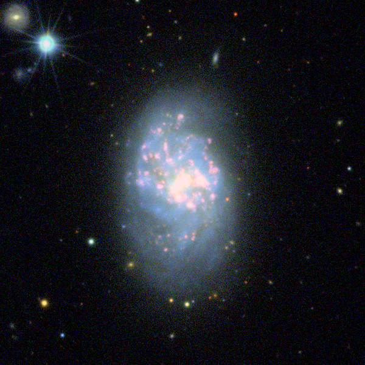

## Obtaining S-PLUS datacubes
Tools for obtaining and analysing S-PLUS datacubes.

*Note:* This is work in progress! If you intend to use this package 
in your research, please send me a message at kadu.barbosa@gmail.com

### Dependences
This code is pure Python, and requires regular scientific libraries 
including numpy, scipy, astropy and pandas. It also depends on the
[splusdata](https://github.com/Schwarzam/splusdata) to download the data 
and also requires that the user is properly registered in the 
[splus cloud website](https://splus.cloud/)

### Installation
Download and content of this package to your computer, unpack the content,
go the the main directory (splus_ifusci) and install with pip:

```bash
pip install .
```
### Usage
A simple usage of the code to produce a datacube for NGC1087.

```python
import getpass # For authentication

import astropy.units as u

import splusdata # To access the S-PLUS database
from splus_ifusci import SCubeMaker, make_RGB_with_overlay

#Connect with S-PLUS
username = getpass.getuser() # Change to your S-PLUS username
password = getpass.getpass(f"Password for {username}:")
conn = splusdata.connect(username, password)
# Specifying your object
galaxy = 'NGC1087'
coords = ['02:46:25.15', '-00:29:55.45'] 
size = 600 # Assume pixels if units is not specified
# Main routine to download the datacube.
scube = SCubeMaker(galaxy, coords, size, conn=conn,
                   coord_unit=(u.hourangle, u.degree))
scube.download_stamps()
scube.make_cube()
halpha, halpha_err = scube.calc_halpha()
# Making RGB image
flam = scube.get_flam().value
rgb_bands = ["I", "R", "G"]
rgb = [flam[scube.bands.index(b)] for b in rgb_bands]
outimg = f"{galaxy}_RGB.png"
make_RGB_with_overlay(*rgb, outimg, overlay=halpha.value)
```
Below is the resulting image.



### Planned features
1. Including filtering options for datacubes.